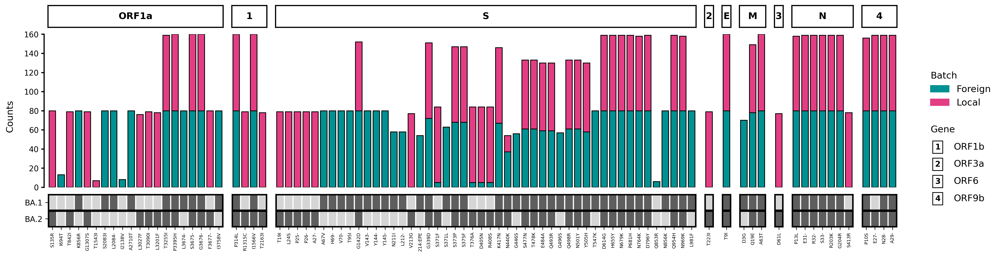

# Quickstart

## Example

If you wish to get started immediately, [install VARGRAM](install_vargram.md) (`pip install vargram`) and [download the test data from the VARGRAM repo](https://github.com/pgcbioinfo/vargram/tree/main/tests/test_data/). Then, run either of the following code snippets on a Jupyter notebook or as a Python script in the directory containing those test files (e.g. inside `test_data/` if you downloaded the entire folder):
=== "Simple script for bare figure"
    The following is the simplest way to generate a profile with default settings:
    ```py
    vg = vargram(data='analysis/omicron_analysis_cli.tsv') # Provide data
    vg.profile() # Tell VARGRAM you want to create a mutation profile
    vg.show() # Show the figure
    vg.save("default_profile.png", dpi=300) # Save the figure
    ```
    This will produce the following bare figure:
    

    ??? question "How are the weights calculated?"

        When multiple batches are detected, the y-axis shows the weighted count of a mutation by default. Per batch, the weight of a mutation is defined as its count (no. of occurences) in the batch divided by all mutation counts in the same batch. Thus, a mutation E156G having a weight of 3 in a batch means that 3% of all mutation counts in that batch are E156G mutations. 

        This choice was made so that two batches with different number of samples can still be compared. The y-axis can be changed to show raw counts even if there are multiple batches.
        
    ??? question "Why are the genes not ordered?"

        By default, the genes are shown based roughly on the no. of mutations it has and these genes are then packed to maintain a rectangular aspect ratio. To get a profile with ordered genes, a genome annotation file must be provided. A horizontal layout of the barplots can also be specified.

=== "Modified script for prettier figure"
    To get a more interesting figure, run the following instead which modifies the labels and the colors, among other things, and adds key mutation heatmaps for reference:
    ```py
    vg = vargram(data='analysis/omicron_analysis_cli.tsv') # Provide data
    vg.profile(threshold=5, # Set minimum count for a mutation to be included
              ytype='counts') # Set y-axis to show raw count
    vg.aes(stack_title='Region', # Change batch legend title
       stack_label=['Foreign', 'Local'], # Change batch names
       stack_color=['#E33E84', '#009193']) # Change batch bar colors
    vg.key('test_data/keys/BA1_key.csv', label='BA.1') # Show key mutations of BA.1
    vg.key('test_data/keys/BA2_key.csv', label='BA.2') # Show key mutations of BA.2
    vg.show() # Show the figure
    vg.save("modified_profile.png", dpi=300) # Save the figure
    ```
    Below is the result:
    

    ??? question "How does the threshold work?"

        The threshold is applied *per batch*. It sets the minimum count of a mutation in a batch for it to be included. If a mutation meets the threshold in at least one batch, it will be included in the figure as a mutation of that batch but it won't show up in the other batches even if the count is nonzero.
    
    ??? question "What are key mutations?"

        In VARGRAM, key mutations are mutations that will be marked in the mutation profile through a heatmap below the barplots. These key mutations may be co-occuring mutations of a variant or lineage, or just mutations of interest for whatever reason. These are helpful for comparing the batches against a reference set of mutations.

    You can also order the genes by providing an annotation file. Additionally, you can force the mutation profile to have a horizontal layout:
    ```py hl_lines="2 5-6"
    vg = vargram(data='analysis/omicron_analysis_cli.tsv', # Provide data
                gene='sc2.gff') # Provide annotation file
    vg.profile(threshold=5, # Set minimum count for a mutation to be included
              ytype='counts', # Set y-axis to show raw count
              order=True, # Order the genes based on the annotation file
              flat=True) # Force a horizontal layout
    vg.aes(stack_title='Region', # Change batch legend title
       stack_label=['Foreign', 'Local'], # Change batch names
       stack_color=['#E33E84', '#009193']) # Change batch bar colors
    vg.key('test_data/keys/BA1_key.csv', label='BA.1') # Show key mutations of BA.1
    vg.key('test_data/keys/BA2_key.csv', label='BA.2') # Show key mutations of BA.2
    vg.show() # Show the figure
    vg.save("ordered_flat_profile.png", dpi=300) # Save the figure
    ```
    Below is the result:
    


## Basic usage

VARGRAM has a declarative syntax that makes it is easy to declare what you want to see in the figure. Every VARGRAM script starts by importing the class `vargram` from the package of the same name:
```py
from vargram import vargram # Importing vargram class
```
??? question "What is a class?"

    A class is a template for creating an object. To use an analogy, a class is like a blueprint for a car (the object) that has attributes like color and functions (called methods) like driving or windshield wiping. An instance of a class is a built object like a Sedan or an SUV.

    The `vargram` class contains all the methods needed to generate the VARGRAM figure and corresponding summary data. Typically, you would get an instance of the class by defining a variable like `vg` in the example below. Methods can be accessed by appending `.method_name()` to the variable, e.g. `vg.profile()`.

A mutation profile can then be generated in just three lines of code:
```py
vg = vargram(seq='path/to/covid_samples/', # Provide sample sequences
            ref='path/to/covid_reference.fa', # Provide reference sequence
            gene='path/to/covid_annotation.gff') # Provide genome annotation
vg.profile() # Tell VARGRAM you want to create a mutation profile
vg.show() # And show the resulting figure
```
Here, the path to the sample sequences can be a folder of FASTA files or a single FASTA file. If you already have a Nextclade analysis file, you can provide the path to that file instead:
```py
vg = vargram(data='path/to/analysis.csv'), # Provide Nextclade analysis file (CSV or TSV)
vg.profile() # Tell VARGRAM you want to create a mutation profile
vg.show() # Show the resulting figure
```
You can get the dataframe containing the mutations and their counts with:
```py
vg.stat()
```
You can also save the figure by adding:
```py
vg.save('my_vargram_figure.jpg')
```
Or save the summary data:
```py
vg.save('my_vargram_data.csv')
```
!!! info "Switching the order of `show()`, `save()`, and `stat()`"

    VARGRAM is built on [Matplotlib](https://matplotlib.org/) and you may see some similarities in terms of syntax. But you may interchange `show()` and `save()` with no worries. In fact, you can save the figure without calling `show()` or save the summary data without calling `stat()`. They are all independent of each other but must be called after `profile()` (see section below about VARGRAM methods).

## VARGRAM methods

### Types
Broadly, the `vargram` class has three main types of methods: (1) "plot", (2) "aesthetic" and (3) "terminal" methods. The plot methods determine what type of figure will be generated. At the moment, there's only one plot method, `profile()`, for generating mutation profiles. 

Aesthetic methods like `aes()` can be used to modify figure characteristics such as labels and colors but other aesthetic methods like `key()` can also be used to add data aside from the sequence files.

Finally, terminal methods like `show()`, `stat()`, and `save()` produce an output like a generated image, a dataframe, or saved file.

!!! info "Optional methods"

    All aesthetic methods are optional. However, a plot method and at least one terminal method are required to be called in order to produce an output. A `vargram` instance must always be defined in order to call these methods.

### Order

The methods should be called in order of their types and form a **PAT** or **PT** sandwich. ***P***lot methods go first, followed by ***A***esthetic methods, and the ***T***erminal methods are called last:
```py
# An instance is defined prior
vg = vargram(data='path/to/analysis.csv')

# *** one plot method ***
vg.profile()
# *** aesthetic methods ***
vg.aes(color=['red','blue']) 
vg.key('my_key.csv')
# *** terminal methods ***
vg.save('my_vargram_figure.pdf')
vg.show()
```
Within each method type, the order doesn't matter. Thus, `vg.key()` can go first before `vg.aes()` or `vg.show()` can be called first before `vg.save()`.

The following examples will *not* produce an output:
=== "A TPA sandwich"
    ```py
    vg = vargram(data='path/to/analysis.csv')
    vg.show()
    vg.profile()
    vg.aes(stack_title='Region')
    ```
=== "An ATP sandwich"  
    ```py
    vg = vargram(data='path/to/analysis.csv')
    vg.key('my_key.csv')
    vg.show()
    vg.profile()
    ```
=== "A TAP sandwich"  
    ```py
    vg = vargram(data='path/to/analysis.csv')
    vg.save('my_vargram_figure.png')
    vg.key('my_key.csv')
    vg.profile()
    ```

The following examples *will* produce an output but the indicated methods will be ignored because they are not inside the PAT or PT sandwich:
=== "Before the sandwich"  
    ```py
    vg = vargram(data='path/to/analysis.csv')
    vg.save('my_vargram_data.csv') # Ignored
    vg.profile()
    vg.show()
    ```
=== "After the sandwich"  
    ```py
    vg = vargram(data='path/to/analysis.csv')
    vg.profile()
    vg.show()
    vg.key('my_key.csv') # Ignored
    ```

You *can* make more than one PAT sandwich:
=== "Same instance"  
    ```py
    vg = vargram(data='path/to/analysis.csv')

    # PAT sandwich no. 1
    vg.profile()
    vg.aes(stack_color=['red', 'blue']) 
    vg.show()
    vg.save()
    vg.key('my_key.csv') # Ignored, not inside a PAT sandwich

    # PAT sandwich no. 2
    vg.profile()
    vg.aes(stack_color=['orange', 'blue']) 
    vg.show()
    vg.save()
    ```
=== "Different instances"  
    ```py
    vg1 = vargram(data='path/to/first_analysis.csv')
    # PAT sandwich no. 1
    vg1.profile()
    vg1.aes(stack_title='Collecting Institution')
    vg1.show()

    vg2 = vargram(data='path/to/second_analysis.csv')
    vg2.profile(threshold=20) # Ignored, only one plot method per sandwich--the latest plot method called before the first terminal method
    # PAT sandwich no. 2
    vg2.profile()
    vg2.key('my_key.csv')
    vg2.show()
    ```

??? question "Why is it like this?"

    Internally, the plot and aesthetic methods only capture their respective inputs and do nothing else. The terminal methods capture their respective inputs, trigger VARGRAM to process the data, and produce their respective outputs. 
    
    The first terminal method called in the sandwich notes the latest plot method before it and all other aesthetic methods (if there are any) inside the sandwich. Then, the data is processed accordingly. This is why all other methods outside the sandwich are ignored. Once the data is processed, all the respective outputs (e.g. generated figure, saved data, etc.) of the terminal methods in the sandwich are produced.
