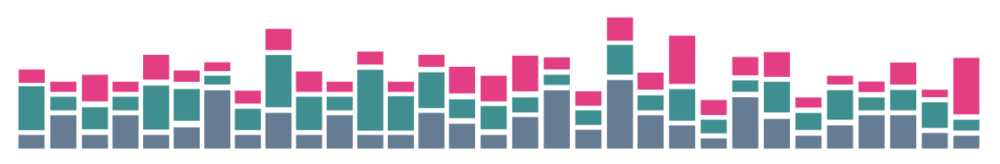

# VARGRAM

## What is VARGRAM?
**VARGRAM** stands for **V**isual **AR**rays for **GR**aphical **A**nalysis of **M**utations. Born out of our experience during the COVID-19 Pandemic, it is envisioned to be a Python library for visualization and analysis of genomic surveillance data. 

Currently, VARGRAM can generate [mutation profiles](mutation_profile.md), which visualizes the (normalized) counts of mutations detected in a single batch or multiple batches of sequences. These profiles are particularly helpful for quickly determining the diversity of sequences/batches. A profile can be generated straight from sequence files in just four lines of code. 

In the coming months, we plan to add more plots and features. Feel free to request a feature or flag a bug by [submitting an issue](https://github.com/pgcbioinfo/vargram/issues).

## Availability

VARGRAM is an open-source tool built on [Matplotlib](https://matplotlib.org/) and [Pandas](https://pandas.pydata.org/) and leverages the power of [Nextclade](https://clades.nextstrain.org/). VARGRAM is available on [PyPI](https://pypi.org/project/vargram/) and in our [GitHub repository](https://github.com/pgcbioinfo/vargram).
