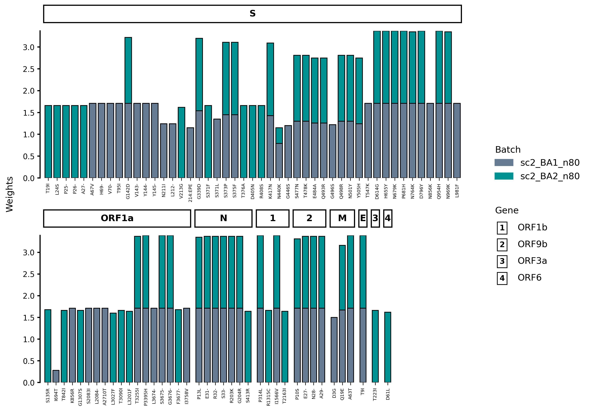
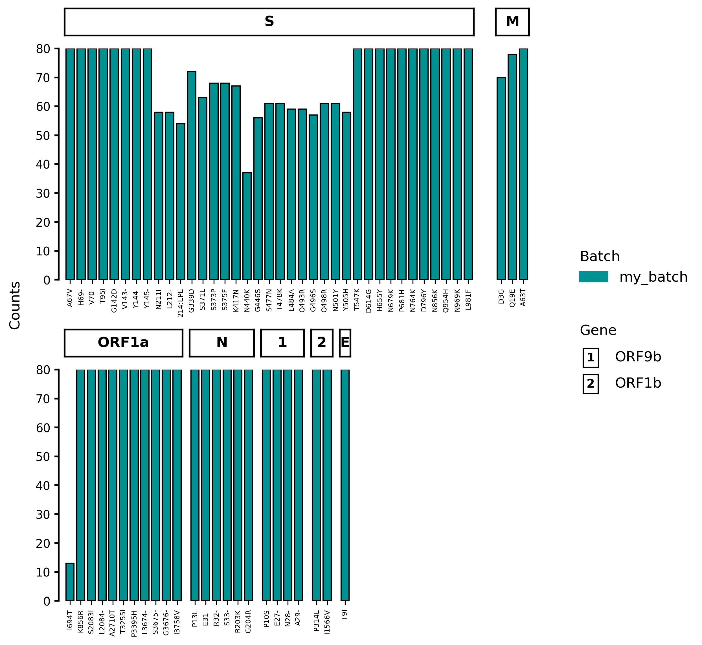
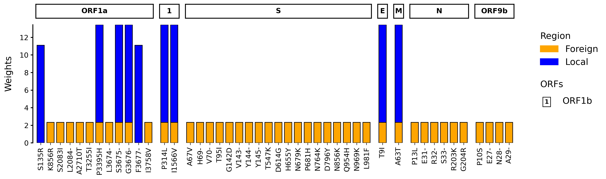
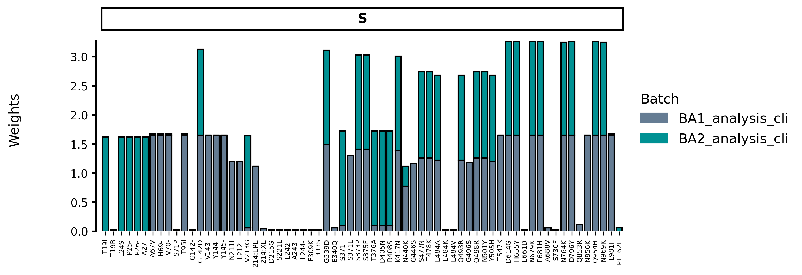
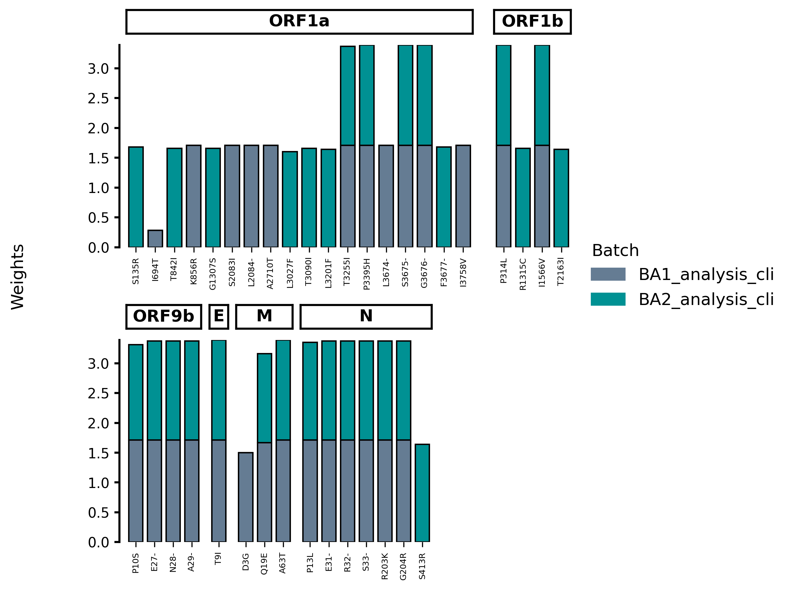
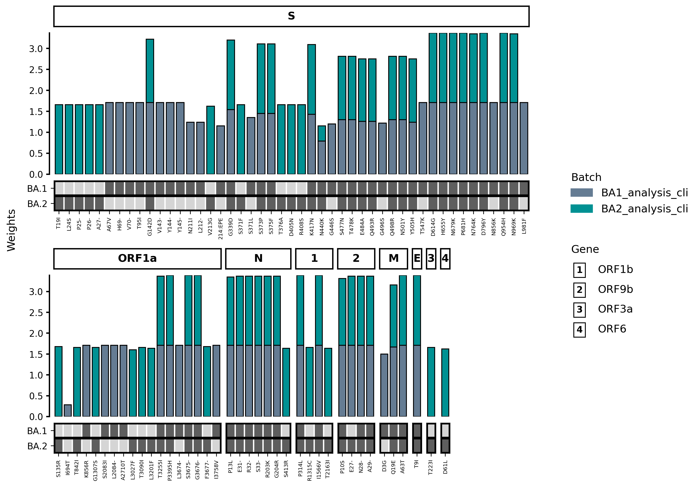
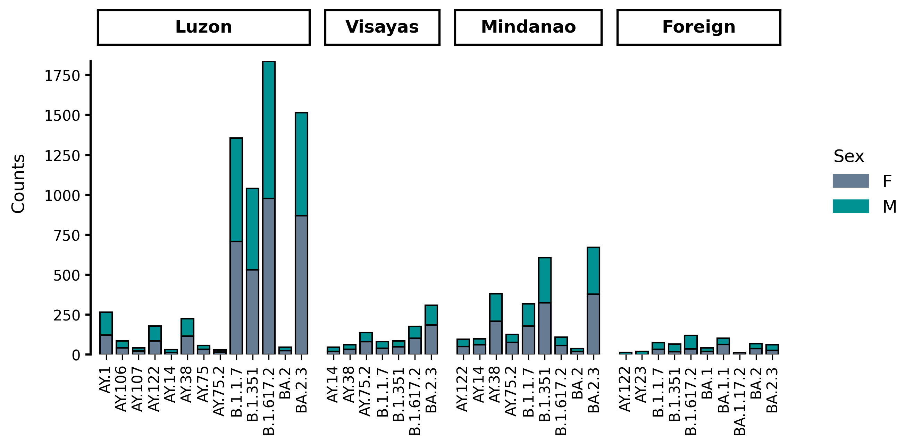
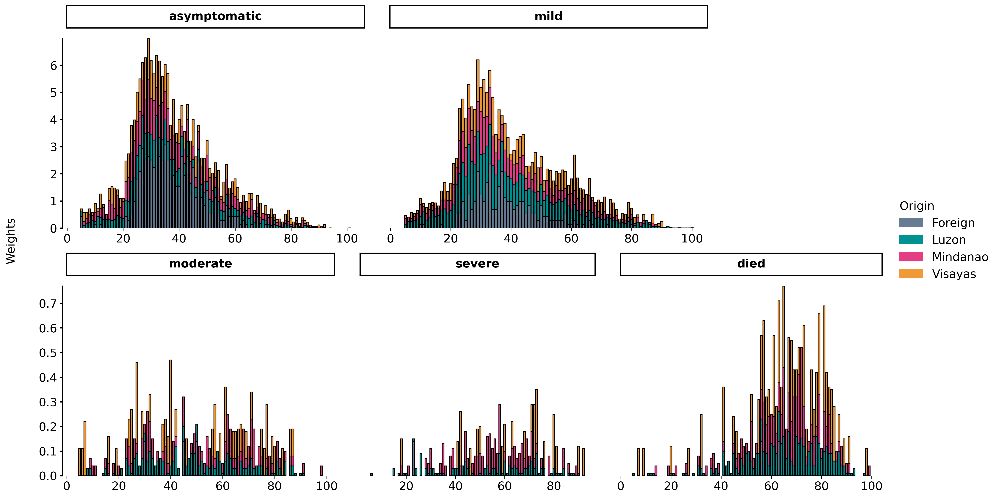

# Generating a mutation profile

!!! tip "Quickstart"
    Make sure to go through the [Quickstart guide](basics.md) first where the basics of VARGRAM syntax are explained.

## Mutation Profile


During an outbreak or a period of genomic surveillance, batches of samples are taken from the field or testing centers
that are then sequenced. Often, the diversity of these sequences need to be quickly identified to understand the evolution
of a pathogen. 

A mutation profile such as the one above is an intuitive figure that shows you what mutations are present in which genes by how many times. Differences among batches can be quickly seen and also be compared against reference sets of mutations. VARGRAM makes it easy to generate these figures.

## Input

### Importing VARGRAM

To import the VARGRAM class, simply run:
```py
from vargram import vargram
```

### Providing sequence files 
There are two main sets of input that you can provide. The first is the sequence files which include (1) the FASTA file of sequences or a directory of FASTA files for multiple batches, (2) the reference FASTA, and (3) a genome annotation file following [the GFF3 format](https://docs.nextstrain.org/projects/nextclade/en/stable/user/input-files/03-genome-annotation.html). An example annotation file is shown below:
```
# Gene map (genome annotation) of SARS-CoV-2 in GFF format.
# For gene map purpses we only need some of the columns. We substitute unused values with "." as per GFF spec.
# See GFF format reference at https://www.ensembl.org/info/website/upload/gff.html
# seqname	source	feature	start	end	score	strand	frame	attribute
.	.	gene	26245	26472	.	+	.	 gene_name=E
.	.	gene	26523	27191	.	+	.	 gene_name=M
.	.	gene	28274	29533	.	+	.	 gene_name=N
.	.	gene	266	13468	.	+	.	 gene_name=ORF1a
.	.	gene	13468	21555	.	+	.	 gene_name=ORF1b
.	.	gene	25393	26220	.	+	.	 gene_name=ORF3a
.	.	gene	27202	27387	.	+	.	 gene_name=ORF6
.	.	gene	27394	27759	.	+	.	 gene_name=ORF7a
.	.	gene	27756	27887	.	+	.	 gene_name=ORF7b
.	.	gene	27894	28259	.	+	.	 gene_name=ORF8
.	.	gene	28284	28577	.	+	.	 gene_name=ORF9b
.	.	gene	21563	25384	.	+	.	 gene_name=S
```


!!! question "Is VARGRAM only applicable to viral data?"

    VARGRAM relies on Nextclade to perform mutation calling when sequence files are provided, and Nextclade [currently supports viral data only](https://docs.nextstrain.org/projects/nextclade/en/stable/user/faq.html#is-nextclade-available-for-other-pathogens-and-microorganisms-too). However, if you can perform mutation calling through another tool, you can still use VARGRAM to create a mutation profile of other organisms provided that you generate a CSV file of the mutations. See [Other features](#other-features). 

Instead of providing the reference FASTA, you may also specify the name or shortcut of a [Nextclade dataset](https://docs.nextstrain.org/projects/nextclade/en/stable/user/datasets.html). In this case, the annotation file does not need to be provided. VARGRAM will download the reference and the annotation (these are deleted after use).

When sequence files are provided, VARGRAM will run Nextclade CLI and capture the analysis file so make sure that Nextclade is [installed](install_nextclade.md). These files can be provided to VARGRAM through the `vargram` class:
=== "Local reference"
    ```py
    vg = vargram(seq='path/to/<samples/>', # Provide FASTA of sequences or directory containing FASTA files
                ref='path/to/<reference.fa>', # Provide reference sequence
                gene='path/to/<annotation.gff>') # Provide genome annotation
    ```
=== "Online Nextclade reference"
    ```py
    vg = vargram(seq='path/to/<samples/>', # Provide sample sequences
                ref='<reference_name>') # Provide reference name/shortcut
    ```

!!! warning "Nextclade dataset name"

    To view available datasets, run `nextclade dataset list`. The official names and shortcuts are on the first `name` column—not the `attribute` column. You may alternatively run `nextclade dataset list --only-names` which only lists the recognized dataset names.

!!! tip "FASTA directory"

    The directory for the sequences need not contain only FASTA files. VARGRAM will ignore all other files in the directory that do not have a `.fasta` or `.fa` extension. But make sure that only the FASTA files of interest are in the directory.

!!! info "Removal of rows with errors and warnings"

    VARGRAM removes sample rows in the captured analysis file that Nextclade flags with an error or warning 


### Providing analysis files

You may already have a Nextclade analysis file obtained through Nextclade CLI or Nextclade Web. In this case, simply provide its path:
```py
vg = vargram(data='path/to/<analysis.csv>')
```
If you want to order the genes in the profile, you must also provide the annotation file using the same keyword argument `gene`.

The VARGRAM data output can also be provided as an input but you must specify its format:
```py
vg = vargram(data='path/to/<vargram_output.csv>',
             format='vargram')
```

!!! warning "Nextclade CLI vs. Nextclade Web"

    Nextclade CLI and Nextclade Web yield identical results when the datasets they use are also the same. If you get different mutation profiles, try updating your dataset. See this [discussion on Nexstrain](https://discussion.nextstrain.org/t/nextclade-cli-clade-calls-different-from-nextclade-web-calls/898) for more info. 


### Downloading test data

Test data from VARGRAM, which can be downloaded from the [VARGRAM repo](https://github.com/pgcbioinfo/vargram/tree/main/tests/test_data), and even datasets from Nextclade can be downloaded. First, import the data download modules:
```py
from vargram.data import example, nextclade
```
The `example` module downloads VARGRAM test data and the `nextclade` module is for Nextclade datasets. Using the latter module requires Nextclade CLI to be installed.

To download VARGRAM test data, run
```py
example.get() # Download VARGRAM test data into current directory
```
This downloads the test data from the VARGRAM release matching your installed version. To download data into a specific directory, run
```py
example.get(dir='path/to/<directory>') # Download test data to specified directory
```

The `nextclade` module is a simple wrapper of the [`nextclade dataset` command](https://docs.nextstrain.org/projects/nextclade/en/stable/user/datasets.html). To get a list of available Nextclade datasets for download, run
```py
nextclade.list() # List names of available Nextclade datasets
```
This will print the names of the datasets. To get a full list of dataset attributes including the version tags, run
```py
nextclade.list(full=True) # Print available Nextclade datasets and their attributes 
```
To download a dataset, run
```py
nextclade.get('dataset_name', # Download Nextclade dataset
              version='<version>', # with this version
              dir='path/to/<directory/')  # into this directory
```
The version and directory arguments are optional. If the directory is not specified, the Nextclade dataset will be downloaded to the current directory.


## Output

In the following examples, we assume that relevant modules have been imported and test data is downloaded to a `test_data/` directory:
```py
# Import modules
from vargram import vargram
from vargram.data import example

# Download test data
example.get('test_data/')
```

!!! tip "Terminal methods are independent"
    VARGRAM outputs are produced by calling terminal methods, which are independent of each other and can therefore be called in any order.

### Showing the plot

To show the mutation profile, simply call the `show()` method:
=== "Using sequence data"
    ```py hl_lines="5"
    vg = vargram(seq='test_data/sequences',
                ref='test_data/sc2_wuhan_2019.fasta',
                gene='test_data/sc2.gff')
    vg.profile()
    vg.show()
    ```
    
=== "Using Nextclade analysis file"
    ```py hl_lines="3"
    vg = vargram(data='test_data/analysis/BA1_analysis_cli.tsv')
    vg.profile()
    vg.show()
    ```
    

### Getting summary data 

The summary data for the mutation profile contains the total counts ([weights](#setting-the-y-axis-type-and-the-count-threshold)) of mutations and the counts (weights) per batch. It can be accessed using the `stat()` method which returns a Pandas DataFrame.  

=== "Single batch"
    ```py hl_lines="3"
    vg = vargram(data='test_data/analysis/BA1_analysis_cli.tsv')
    vg.profile()
    vg.stat()
    ```
    This will return the following dataframe:

    {{ read_csv('tests/test_data/summary/BA1_summary_data.csv', colalign=('left','left','left','left','left','left')) }}

    At the minimum, the columns include the `gene`, `mutation`, `position`, mutation `type` as well as the name of the batch (here, `my_batch`) and the total count of the mutation (`sum`). When there is only one batch and the input is a Nextclade analysis file, the default batch name is `my_batch`.

=== "Multiple batches"
    ```py hl_lines="3"
    vg = vargram(data='test_data/analysis/omicron_analysis_cli.tsv')
    vg.profile()
    vg.stat()
    ```
    This will return the following dataframe:

    {{ read_csv('tests/test_data/summary/omicron_summary_data.csv', colalign=('left','left','left','left','left','left','left')) }}

    When there are multiple batches, each batch gets their own column containing the mutation counts in that batch.

=== "Multiple batches with keys"
    ```py hl_lines="5"
    vg = vargram(data='test_data/analysis/omicron_analysis_cli.tsv')
    vg.profile()
    vg.key('test_data/keys/BA1_key.csv')
    vg.key('test_data/keys/BA2_key.csv')
    vg.stat()
    ```
    This will return the following dataframe:

    {{ read_csv('tests/test_data/summary/omicron_summary_data_with_keys.csv', colalign=('left','left','left','left','left','left','left','left','left')) }}

    [Keys](#adding-and-creating-keys) (here, `BA.1` and `BA.2`) get their own columns. A `1` indicates that the mutation is part of that key and a `0` indicates that it's not. The data above is the summary data for `omicron_analysis_cli.csv` with the keys `BA1_key.csv` and `BA2_key.csv`.

### Saving the plot or data

Use the `save()` method to save either the mutation profile figure or the accompanying data:

=== "Save figure"
    ```py hl_lines="3"
    vg = vargram(data='test_data/analysis/omicron_analysis_cli.tsv')
    vg.profile()
    vg.save('saved_figure.png')
    ```

    When the figure is saved (i.e. when the extension is `.png`, `.pdf` or `.jpg`), `save()` acts like [Matplotlib's `matplotlib.pyplot.savefig()`](https://matplotlib.org/stable/api/_as_gen/matplotlib.pyplot.savefig.html) with the `bbox_inches` argument set to `tight`. Thus, `save()` can take other `savefig()` arguments like `dpi` or `transparent`, e.g.
    ```py hl_lines="3"
    vg = vargram(data='test_data/analysis/omicron_analysis_cli.tsv')
    vg.profile()
    vg.save('transparent_figure.png', dpi=300, transparent=True)
    ```
=== "Save data"
    ```py hl_lines="3"
    vg = vargram(data='test_data/analysis/omicron_analysis_cli.tsv')
    vg.profile()
    vg.save('omicron_summary.csv')
    ```

    When the summary data is saved (i.e. when the extension is *not* `.png`, `.pdf` or `.jpg`), `save()` acts like [Pandas' `pandas.DataFrame.to_csv()`](https://pandas.pydata.org/docs/reference/api/pandas.DataFrame.to_csv.html) with the `sep` argument automatically set for `.csv` (`sep=','`), `.tsv` (`sep='\t'`) and `.txt` (`sep=' '`) extensions, and `index` set to `False`. Thus, `save()` can take other `to_csv()` arguments like `columns`, e.g.
    ```py hl_lines="3"
    vg = vargram(data='test_data/analysis/omicron_analysis_cli.tsv')
    vg.profile()
    vg.save('modified_summary.csv', index=True, columns=['gene','mutation','syum'])
    ```

## Customization

### Setting the y-axis type and the count threshold

The y-axis of the profile can show either the raw count of a mutation (i.e. no. of sequences that has the mutation) or its weight. The weight of a mutation is simply the count of a mutation in a batch divided by the sum of all mutation counts in that batch. Whether the count or weight is shown can be changed through the `profile()` method:
=== "Show counts"
    ``` hl_lines="2"
    vg = vargram(data='test_data/analysis/omicron_analysis_cli.tsv')
    vg.profile(ytype='counts')
    vg.show()
    ```
=== "Show weights"
    ``` hl_lines="2"
    vg = vargram(data='test_data/analysis/omicron_analysis_cli.tsv')
    vg.profile(ytype='weights')
    vg.show()
    ```
By default, when multiple batches are provided, the y-axis shows the weights.

On the other hand, the threshold (default: `50`) is the minimum count or no. of occurences of a mutation in a batch that is needed for a mutation to be included in the figure. The threshold is applied per batch and a mutation will only be shown in the batch that it meets the threshold but it will have a count of zero in every other batch.

??? example "Threshold example" 
    To make this more concrete, suppose we have two batches, each with 200 sequences. Suppose a mutation D3G occurs in 150 out of 200 samples in the first batch, but it occurs only 30 times in the second batch. With a default threshold of 50, D3G will show up in the profile as a mutation in the first batch with a count of 150. But D3G will not register as a mutation in the second batch--its count will be zero even if 30 sequences actually have the mutation in that batch.

!!! warning "Small number of samples"
    Lowering the threshold is necessary if the number of samples is lower than the threshold (default: `50`).

The threshold can also be changed through `profile()`:
```py hl_lines="2"
vg = vargram(data='test_data/analysis/omicron_analysis_cli.tsv')
vg.profile(threshold=10)
vg.show()
```

### Changing aesthetic attributes

Aesthetic attributes like colors, labels, and font sizes can be changed through the `aes()` method:
```py hl_lines="4-14"
vg = vargram(data='test_data/analysis/omicron_analysis_cli.tsv',
             gene='test_data/sc2.gff')
vg.profile(threshold=80)
vg.aes(stack_title='Region', # Change batch legend title
        stack_label=['Foreign', 'Local'], # Change batch names
        stack_color=['orange', 'blue'], # Change batch bar colors
        group_title='ORFs', # Change gene legend title
        legtitle_fontsize=15, # Change legend title font size
        legentry_fontsize=15, # Change legend entry font size
        ylabel_fontsize=15, # Change y-axis label font size
        yticks_fontsize=12, # Change y-axis ticks font size
        xticks_fontsize=12, # Change x-axis ticks font size
        flat=True, # Enforce a horizontal layout
        order=True) # Order the genes by their start positions
vg.show()
```
This produces the following figure:



The full list of accepted arguments can be seen [here](/vargram/reference/vargram/vargram/#vargram.vargram.vargram.aes). Of particular note is `flat` which forces a horizontal layout and the `order` argument which orders the genes based on their start position. This requires a genome annotation file to be provided. 

??? question "Why is a batch referred to as a stack and a gene referred to as a group?"

    A profile figure (essentially a grid of barplots) can be generated without using Nextclade data or even sequence-specific data. For this reason, the variable names were chosen to be agnostic. See [Other features](#other-features).

### Modifying plot structure

VARGRAM automatically determines which gene barplot goes to which row and in what order in an attempt to create a compact figure. However, you may want to rearrange the rows and/or show only certain genes. If you want to keep only certain genes and specify a particular order, 
then you can use the `struct()` method, which takes one required positional argument: 
a formatted string where gene or group names are separated by a comma and rows are separated by a forward slash.


=== "Show single gene"
    To show only one gene, simply provide its name to `struct()`:
    ```py hl_lines="4"
    vg = vargram(data='test_data/analysis/omicron_analysis_cli.tsv')
    vg.profile(threshold=1)
    vg.aes(figsize=(10,3.5))
    vg.struct('S') # Show the 'S' gene only
    vg.show()
    ```
    
=== "Arrange multiple genes in an order"
    Multiple genes can be arranged into a desired order. Genes on the same row are separated by a comma with no extra spaces and genes (or groups of genes) are separated by a forward slash.
    ```py hl_lines="4-6"
    vg = vargram(data='test_data/analysis/omicron_analysis_cli.tsv')
    vg.profile()
    vg.aes(figsize=(8,6))
    # Put ORF1a and ORF1b on the first row in that order 
    # and put ORF9b, E, M, and N on second row in that order
    vg.struct('ORF1a,ORF1b/ORF9b,E,M,N') 
    vg.show()
    ```
    

### Adding and creating keys

It is often helpful not just to compare batches with each other but also against reference lineages. 
This can be done by adding a key, which is a CSV or TSV file with`gene` and `mutation` columns.
The mutations can be representative ("key") mutations of a lineage or they could just be mutations of interest for whatever reason. VARGRAM will mark these mutations in the profile through a heatmap below the barplots. 

The keys can be added with the `key()` method. Each key is added individually:
```py hl_lines="3-4"
vg = vargram(data='test_data/analysis/omicron_analysis_cli.tsv')
vg.profile()
vg.key('test_data/keys/BA1_key.csv', label='BA.1') # Add first key
vg.key('test_data/keys/BA2_key.csv', label='BA.2') # Add another key
vg.show()
```


Key mutations will always be shown on the x-axis even if they are not found in any of the batches. Note however that if those key mutations do not meet the threshold, there will be an empty column for it in the barplot but no bar will be shown. On the other hand, any mutation that meets the threshold in any of the batches will always be shown even if it is not a key mutation.

You can manually create these key files yourself, but note that the format of mutation must follow Nextclade's notation. 
See the [`aaSubstitutions`, `aaDeletions`, and `aaInsertions` definitions](https://docs.nextstrain.org/projects/nextclade/en/stable/user/output-files/04-results-tsv.html).

Alternatively, the VARGRAM summary data can serve as a key file. 
To create a key with VARGRAM, simply provide the batch of sequences from which key mutations will be identified. 
In this case, those key mutations can be identified as those that met a high threshold.

## Other features

Although VARGRAM was made in the context of viral genomic surveillance, data from any CSV or TSV file or a Pandas DataFrame can be extracted to generate a mutation profile-type figure. The input tabular data needs to have three columns that will play the role of the gene, the mutation, and the batch. 

These columns can be specified in the `profile()` method through the arguments `x`, `group`, and `stack`:

1. The `x` (default `mutation`) argument specifies the column from which to take the x-axis values for the bar plots.
2. The `group` (default `gene`) argument specifies the column whose unique values will determine the bar plots (with their corresponding `x` values) to be created.
3. The `stack` (default `batch`) argument specifies the column for the batches or the sets of (`x` value, `y` value) pairs.

As an example, consider the following metadata (`voc_metadata.csv` from the test data):

{{ read_csv('tests/test_data/metadata/voc_metadata.csv') }}

This file contains the metadata of a subset of SARS-CoV-2 sequences from the Philippines. It contains the following columns: `island` corresponding to the three major island groups in the Philippines (Luzon, Visayas and Mindanao); `region` corresponding to the 13 regions; the assigned `lineage` of the sequenced sample; the corresponding `variant`; `age` and `sex` of the patient as well as the `severity` of their symptoms.

Running the following code block produces the distribution of lineages across the major island groups, stratified by sex:
```py hl_lines="3-5"
vg = vargram(data='test_data/metadata/voc_metadata.csv', # Get the data
            format='delimited') # (1) Tell VARGRAM that this is a non-Nextclade, tabulated file
vg.profile(group='island', # Group the barplots by island (the "genes")
           x='lineage', # Make the lineages the x-axis categories (the "mutations")
           stack='sex', # Stack bars based on sex (the "batches")
           ytype='counts') # Show raw counts
vg.aes(stack_title='Sex', # Change stack legend title
       xticks_fontsize=10) # Change x-axis ticks font size
vg.struct('Luzon,Visayas,Mindanao,Foreign') # Place the groups in this order
vg.show() # Show the figure
vg.save('lineages_distribution.png', dpi=300) # Save the figure
```

1. When the `data` argument is used and the optional `format` argument is not, VARGRAM assumes that the file is a Nextclade analysis file which would result to default, fixed settings. By specifying `format=delimited`, VARGRAM would not run the file through the internal Nextclade wrangler functions.

This will result to the following profile:


As another example, we can take the same metadata but this time show the distribution of severity of symptoms:
```py hl_lines="3-5"
vg = vargram(data='test_data/metadata/voc_metadata.csv', # Get the data
            format='delimited') # (1) Tell VARGRAM that this is a non-Nextclade, tabulated file
vg.profile(group='severity', # Group the barplots by severity (the "genes")
           x='age', # (2) Let age constitute the x-axis (the "mutations")
           stack='island', # Stack bars based on island (the "batches")
           threshold=1, # Set a minimum threshold of 1
           ytype='weights') # Use proportions/weights instead of raw counts
vg.aes(stack_title="Origin", # Change stack legend title
       group_title="Severity", # Change the group legend title
       group_fontsize=15, # Set group font size
       xticks_fontsize=15, # Set x-axis ticks font size
       xticks_rotation=0, # Set angle of x-axis ticks
       ylabel_fontsize=15, # Set y-axis label font size
       yticks_fontsize=15, # Set y-axis ticks font size
       legtitle_fontsize=15, # Set legend title font size
       legentry_fontsize=15, # Set legend entries font size
       figsize=(18,9)) # Set figure size
vg.struct('asymptomatic,mild/moderate,severe,died') # Show the barplots in this order
vg.show() # Show the figure
vg.save("severity_distribution.png", dpi=300) # Save the figure
```

1. When the `data` argument is used and the optional `format` argument is not, VARGRAM assumes that the file is a Nextclade analysis file which would result to default, fixed settings. By specifying `format=delimited`, VARGRAM would not run the file through the internal Nextclade wrangler functions.
2. When the x-axis values are numerical, ticks and labels do not show for each value.

This will save the following figure:
