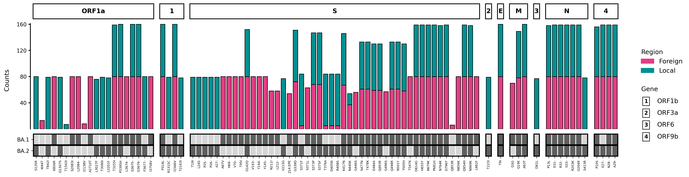
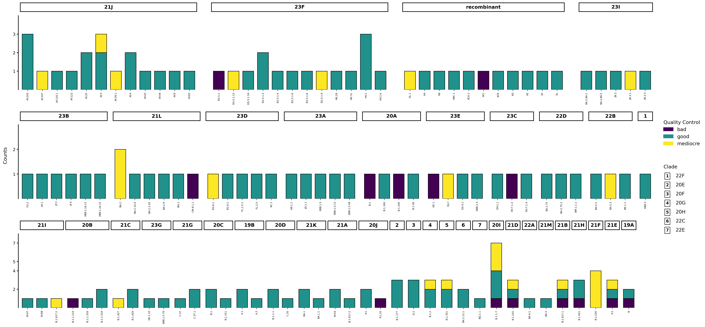

# Generating a mutation profile

!!! tip "Quickstart"
    Make sure to go through the [Quickstart guide](basics.md) first where the basics of VARGRAM syntax are explained.

## Mutation Profile



During an outbreak or a period of genomic surveillance, batches of samples are taken from the field or testing centers
that are then sequenced. Often, the diversity of these sequences need to be quickly identified to understand the evolution
of a pathogen. 

A mutation profile such as the one above is an intuitive figure that shows you what mutations are present in which genes by how many times. Differences among batches can be quickly seen and also be compared against reference sets of mutations. VARGRAM makes it easy to generate these figures.

## Input

### Providing sequence files 
There are two main sets of input that you can provide. The first is the sequence files which include (1) the FASTA file of sequences or a directory of FASTA files for multiple batches, (2) the reference FASTA, and (3) a genome annotation file following [the GFF3 format](https://docs.nextstrain.org/projects/nextclade/en/stable/user/input-files/03-genome-annotation.html). 

!!! question "Is VARGRAM only applicable to viral data?"

    VARGRAM relies on Nextclade to perform mutation calling when sequence files are provided, and Nextclade [currently supports viral data only](https://docs.nextstrain.org/projects/nextclade/en/stable/user/faq.html#is-nextclade-available-for-other-pathogens-and-microorganisms-too). However, if you can perform mutation calling through another tool, you can still use VARGRAM to create a mutation profile of other organisms provided that you generate a CSV file of the mutations. See [Other features](#other-features). 

Instead of providing the reference FASTA, you may also specify the name or shortcut of a [Nextclade dataset](https://docs.nextstrain.org/projects/nextclade/en/stable/user/datasets.html). In this case, the annotation file does not need to be provided. VARGRAM will download the reference and the annotation (these are deleted after use).

When sequence files are provided, VARGRAM will run Nextclade CLI and capture the analysis file so make sure that Nextclade is [installed](install_nextclade.md). These files can be provided to VARGRAM through the `vargram` class:
=== "Local reference"
    ```py
    vg = vargram(seq='path/to/covid_samples/', # Provide FASTA of sequences or directory containing FASTA files
                ref='path/to/covid_reference.fa', # Provide reference sequence
                gene='path/to/covid_annotation.gff') # Provide genome annotation
    ```
=== "Online Nextclade reference"
    ```py
    vg = vargram(seq='path/to/covid_samples/', # Provide sample sequences
                ref='sars-cov-2') # Provide reference name/shortcut
    ```

!!! warning "Nextclade dataset name"

    To view available datasets, run `nextclade dataset list`. The official names and shortcuts are on the first `name` column—not the `attribute` column. You may alternatively run `nextclade dataset list --only-names` which only lists the recognized dataset names.

!!! tip "FASTA directory"

    The directory for the sequences need not contain only FASTA files. VARGRAM will ignore all other files in the directory that do not have a `.fasta` or `.fa` extension. But make sure that only the FASTA files of interest are in the directory.

!!! info "Removal of rows with errors and warnings"

    VARGRAM removes sample rows in the captured analysis file that Nextclade flags with an error or warning 


### Providing analysis files

You may already have a Nextclade analysis file obtained through Nextclade CLI or Nextclade Web. In this case, simply provide its path:
```py
vg = vargram(data='path/to/nextclade_analysis.csv')
```
If you want to order the genes in the profile, you must also provide the annotation file using the same keyword argument `gene`.

The VARGRAM data output can also be provided as an input but you must specify its format:
```py
vg = vargram(data='path/to/vargram_analysis.csv',
             format='vargram')
```

!!! warning "Nextclade CLI vs. Nextclade Web"

    Nextclade CLI and Nextclade Web yield identical results when the datasets they use are also the same. If you get different mutation profiles, try updating your dataset. See this [discussion on Nexstrain](https://discussion.nextstrain.org/t/nextclade-cli-clade-calls-different-from-nextclade-web-calls/898) for more info. 

## Output

!!! tip "Terminal methods are independent"
    VARGRAM outputs are produced by calling terminal methods, which are independent of each other and can therefore be called in any order.

### Showing the plot

To show the mutation profile, simply call the `show()` method, e.g.
```py hl_lines="3"
vg = vargram(data='path/to/nextclade_analysis.csv')
vg.profile()
vg.show()
```

### Getting summary data 

The summary data for the mutation profile contains the total counts of mutations and the counts per batch. It can be accessed using the `stat()` method which returns a Pandas DataFrame:
```py hl_lines="3"
vg = vargram(data='path/to/nextclade_analysis.csv')
vg.profile()
vg.stat()
```
The summary data contains the following columns:

=== "Single batch"
    {{ read_csv('assets/data/BA1_summary_data.csv', colalign=('left','left','left','left','left','left')) }}

    At the minimum, the columns include the `gene`, `mutation`, `position`, mutation `type` as well as the name of the batch (here, `my_batch`) and the total count of the mutation (`sum`). The data above is the summary data for `BA1_analysis_cli.csv`. When there is only one batch, the default batch name is `my_batch`.

=== "Multiple batches"
    {{ read_csv('assets/data/omicron_summary_data.csv', colalign=('left','left','left','left','left','left','left')) }}

    When there are multiple batches, each batch gets their own column containing the mutation counts in that batch. The data above is the summary data for `omicron_analysis_cli.csv`.

=== "Multiple batches with keys"
    {{ read_csv('assets/data/omicron_summary_data_with_keys.csv', colalign=('left','left','left','left','left','left','left','left','left')) }}

    Keys (here, `BA.1` and `BA.2`) get their own columns. A `1` indicates that the mutation is part of that key and a `0` indicates that it's not. The data above is the summary data for `omicron_analysis_cli.csv` with the keys `BA1_key.csv` and `BA2_key.csv`.

### Saving the plot or data

Use the `save()` method to save either the mutation profile figure or the accompanying data:

=== "Save figure"
    ```py hl_lines="3"
    vg = vargram(data='path/to/nextclade_analysis.csv')
    vg.profile()
    vg.save('my_figure.png')
    ```

    When the figure is saved (i.e. when the extension is `.png`, `.pdf` or `.jpg`), `save()` acts like [Matplotlib's `matplotlib.pyplot.savefig()`](https://matplotlib.org/stable/api/_as_gen/matplotlib.pyplot.savefig.html) with the `bbox_inches` argument set to `tight`. Thus, `save()` can take other `savefig()` arguments like `dpi` or `transparent`, e.g.
    ```py hl_lines="3"
    vg = vargram(data='path/to/nextclade_analysis.csv')
    vg.profile()
    vg.save('my_figure.png', dpi=300, transparent=True)
    ```
=== "Save data"
    ```py hl_lines="3"
    vg = vargram(data='path/to/nextclade_analysis.csv')
    vg.profile()
    vg.save('my_data.csv')
    ```

    When the summary data is saved (i.e. when the extension is *not* `.png`, `.pdf` or `.jpg`), `save()` acts like [Pandas' `pandas.DataFrame.to_csv()`](https://pandas.pydata.org/docs/reference/api/pandas.DataFrame.to_csv.html) with the `sep` argument automatically set for `.csv` (`sep=','`), `.tsv` (`sep='\t'`) and `.txt` (`sep=' '`) extensions, and `index` set to `False`. Thus, `save()` can take other `to_csv()` arguments like `columns`, e.g.
    ```py hl_lines="3"
    vg = vargram(data='path/to/nextclade_analysis.csv')
    vg.profile()
    vg.save('my_data.csv', index=True, columns=['gene','mutation','batch_1'])
    ```

## Customization

### Setting the y-axis type and the count threshold

The y-axis of the profile can show either the raw count of a mutation (i.e. no. of sequences that has the mutation) or its weight. The weight of a mutation is simply the count of a mutation in a batch divided by the sum of all mutation counts in that batch. Whether the count or weight is shown can be changed through the `profile()` method:
=== "Show counts"
    ``` hl_lines="2"
    vg = vargram(data='path/to/nextclade_analysis.csv')
    vg.profile(ytype='counts')
    vg.show()
    ```
=== "Show weights"
    ``` hl_lines="2"
    vg = vargram(data='path/to/nextclade_analysis.csv')
    vg.profile(ytype='weights')
    vg.show()
    ```
By default, when multiple batches are provided, the y-axis shows the weights.

On the other hand, the threshold (default 50) is the minimum count or no. of occurences of a mutation in a batch that is needed for a mutation to be included in the figure. The threshold is applied per batch and a mutation will only be shown in the batch that it meets the threshold but it will have a count of zero in every other batch.

??? example "Threshold example" 
    To make this more concrete, suppose we have two batches, each with 200 sequences. Suppose a mutation D3G occurs in 150 out of 200 samples in the first batch, but it occurs only 30 times in the second batch. With a default threshold of 50, D3G will show up in the profile as a mutation in the first batch with a count of 150. But D3G will not register as a mutation in the second batch--its count will be zero even if 30 sequences actually have the mutation in that batch.

The threshold can also be changed through `profile()`:
```py hl_lines="2"
vg = vargram(data='path/to/nextclade_analysis.csv')
vg.profile(threshold=10)
vg.show()
```

### Changing aesthetic attributes

Aesthetic attributes like colors, labels, and font sizes can be changed through the `aes()` method:
```py hl_lines="3-12"
vg = vargram(data='path/to/nextclade_analysis.csv')
vg.profile()
vg.aes(stack_title='Region', # Change batch legend title
        stack_label=['Foreign', 'Local'], # Change batch names
        stack_color=['#E33E84', '#009193'], # Change batch bar colors
        group_title='ORFs', # Change gene legend title
        legtitle_fontsize=15, # Change legend title font size
        legentry_fontsize=10, # Change legend entry font size
        ylabel='Normalized Count', # Change y-axis label
        ylabel_fontsize=30, # Change y-axis label fontsize
        xticks_rotation=45, # Change x-axis ticks rotation
        xticks_fontsize=5) # Change x-axis ticks label fontsize
vg.show()
```
??? question "Why is a batch referred to as a stack and a gene referred to as a group?"

    A profile figure (essentially a grid of barplots) can be generated without using Nextclade data or even sequence-specific data. For this reason, the variable names were chosen to be agnostic. See [Other features](#other-features).

### Ordering genes

VARGRAM automatically determines which gene barplot goes to which row and in what order in an attempt to create a compact figure. 
However, you may want to rearrange the rows and/or show only certain genes. 
You can order genes according to their start position and/or fix the profile to have a horizontal layout through the `profile()` method:
```py hl_lines="2-3"
vg = vargram(data='path/to/nextclade_analysis.csv')
vg.profile(order=True, # Order the genes based on the annotation file
           flat=True) # Force a horizontal layout
vg.show()
```
If you want to keep only certain genes and specify a particular order, 
then you can use the `struct()` method, which takes one required positional argument: 
a formatted string where gene or group names are separated by a comma and rows are separated by a forward slash.

Suppose we have the following genes: 'ORF1a', 'ORF1b', 'M', 'S', and 'N'. 
Say we only want to keep 'ORF1a', 'ORF1b' and 'M' such that on the first row 'M' is followed by 'ORF1a' and on the second row is 'ORF1b' alone. This new structure can be specified as follows:
```py hl_lines="3-4"
vg = vargram(data='path/to/nextclade_analysis.csv')
vg.profile()
vg.struct('M,ORF1a/ORF1b') # Put M & ORF1a in first row in that order 
                           # and put ORF1b in second row
vg.show()
```

### Adding and creating keys

It is often helpful not just to compare batches with each other but also against reference lineages. 
This can be done by adding a key, which is a CSV or TSV file with`gene` and `mutation` columns.
The mutations can be representative ("key") mutations of a lineage or they could just be mutations of interest.
VARGRAM will mark these mutations in the profile through a heatmap below the barplots. 
The keys can be added with the `key()` method. Each key is added individually:
```py hl_lines="3-5"
vg = vargram(data='path/to/nextclade_analysis.csv')
vg.profile()
vg.key('path/to/my_key1.csv') # Provide key file 1
vg.key('path/to/my_key2.csv',
        label='Key 2') # Add an optional label
vg.show()
```

You can manually create these key files yourself, but note that the format of mutation must follow Nextclade's notation. 
See the [`aaSubstitutions`, `aaDeletions`, and `aaInsertions` definitions](https://docs.nextstrain.org/projects/nextclade/en/stable/user/output-files/04-results-tsv.html).

Alternatively, the VARGRAM summary data can serve as a key file. 
To create a key with VARGRAM, simply provide the batch of sequences from which key mutations will be identified. 
In this case, those key mutations can be identified as those that met a high threshold.

## Other features

Although VARGRAM was made in the context of viral genomic surveillance, data from any CSV or TSV file or a Pandas DataFrame can be extracted to generate a mutation profile-type figure. The input tabular data needs to have three columns that will play the role of the gene, the mutation, and the batch. 

These columns can be specified in the `profile()` method through the arguments `x`, `group`, and `stack`:

1. The `x` (default `mutation`) argument specifies the column from which to take the x-axis values for the bar plots.
2. The `group` (default `gene`) argument specifies the column whose unique values will determine the bar plots (with their corresponding `x` values) to be created.
3. The `stack` (default `batch`) argument specifies the column for the batches or the sets of (`x` value, `y` value) pairs.

For example, consider the file `XBB_analysis_web.tsv` from the test data. This is a Nextclade analysis file, but we can still use it to show the flexibility of VARGRAM. Suppose that we want the `clade` column to play the role of the genes, the unique values of the `qc.overallStatus` to be the batches, and the x-axis values to be given by the `Nextclade_pango` column. The code should look as follows:

```py hl_lines="3-5"
vg = vargram(data='test_data/analysis/XBB_analysis_web.tsv', 
            format='delimited') # (1)
vg.profile(group='clade',
           x='Nextclade_pango', 
           stack='qc.overallStatus', 
           threshold=1
           ytype='counts')
vg.aes(stack_title="Quality Control",
       group_title="Clade")
vg.show()
```

1. When the `data` argument is used and the optional `format` argument is not, VARGRAM assumes that the file is a Nextclade analysis file which would result to default, fixed settings. By specifying `format=delimited`, VARGRAM would not run the file through the internal Nextclade wrangler functions.

This will result to the following profile:


